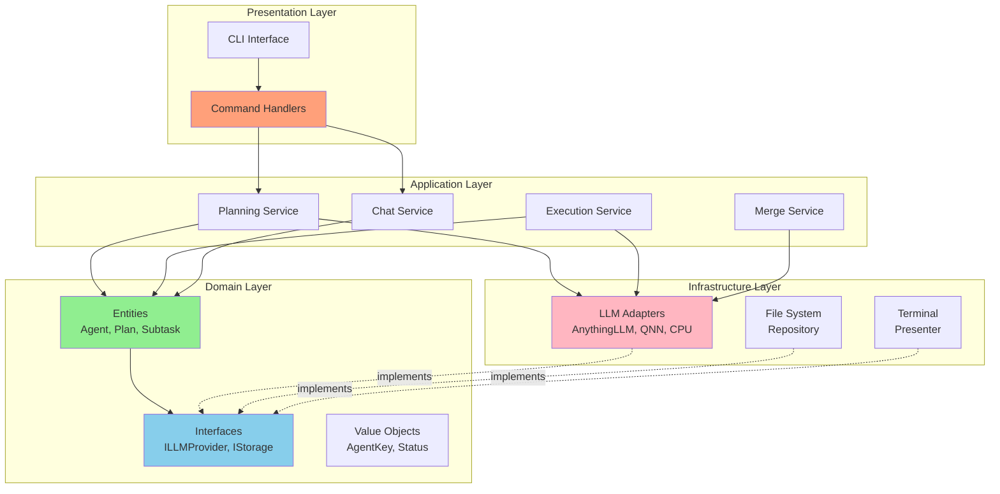
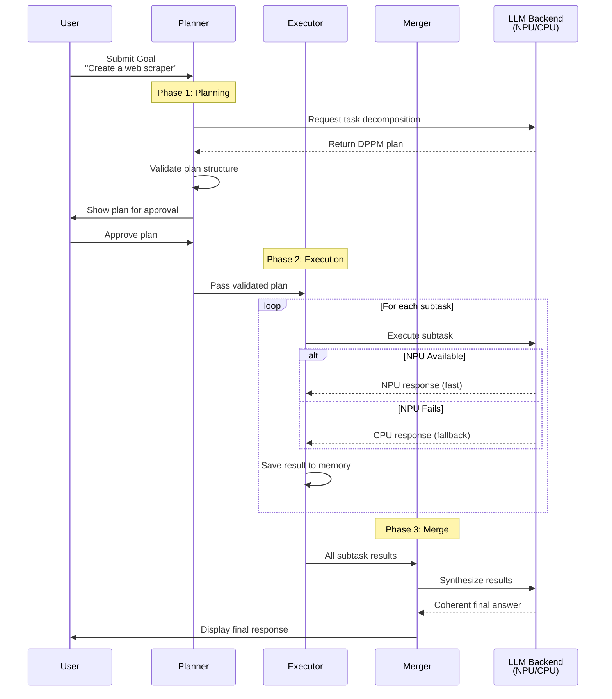
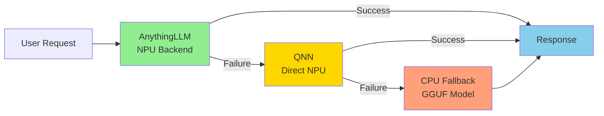

# SelfAI NPU Agent 🚀

> **AI-Powered Terminal Chatbot with Multi-Backend Inference and NPU Acceleration**

[](https://www.python.org/downloads/)
[](LICENSE)
[](https://github.com/psf/black)
[](http://mypy-lang.org/)
[](REFACTORING_PLAN.md)

A sophisticated AI chatbot with **intelligent task decomposition**, **multi-backend LLM inference**, and **hardware NPU acceleration** for Windows on ARM (Snapdragon X Elite). Features a three-phase pipeline (Planning → Execution → Merge) with automatic fallback from NPU to CPU.

---

## ✨ Key Features

- 🧠 **Three-Phase Intelligent Pipeline**
  - **Planning**: Decomposes complex goals into executable subtasks (DPPM format)
  - **Execution**: Runs subtasks with dependency management and parallelization
  - **Merge**: Synthesizes results into coherent final answers

- ⚡ **Multi-Backend LLM Support** with automatic failover:
  - **AnythingLLM** (NPU) - Primary: Hardware-accelerated via Snapdragon X NPU
  - **QNN** (NPU) - Secondary: Direct NPU model execution
  - **CPU Fallback** - Tertiary: GGUF models via llama-cpp-python

- 🎯 **Specialized AI Agents**
  - Code Helper, Project Manager, Travel Planner, etc.
  - Each agent has unique personality, memory, and workspace

- 💾 **Persistent Memory System**
  - Context-aware conversation storage
  - Smart retrieval of relevant past interactions
  - Organized by agent and category

- 🛠️ **Extensible Tool System**
  - Weather lookup, calendar management, file operations
  - Function calling support for LLMs
  - Easy to add custom tools

- 🏗️ **Clean Architecture**
  - SOLID principles throughout
  - Domain-driven design
  - Dependency inversion for easy testing

---

## 📊 Architecture Overview

### System Architecture (Clean Architecture)



### Three-Phase Pipeline



### Backend Fallback Chain



---

## 🚀 Quick Start

### Prerequisites

- **Python 3.12+** (ARM64 for NPU support on Windows ARM)
- **8GB+ RAM** (16GB recommended)
- **Git**

### Installation (CPU-Only Mode)

```bash
# Clone the repository
git clone https://github.com/smlfg/SelfAi-NPU-AGENT.git
cd SelfAi-NPU-AGENT

# Create virtual environment
python -m venv .venv
source .venv/bin/activate  # On Windows: .\.venv\Scripts\activate

# Install dependencies
pip install -e ".[dev]"

# Download a CPU model (Phi-3-mini recommended)
mkdir -p models
wget https://huggingface.co/microsoft/Phi-3-mini-4k-instruct-gguf/resolve/main/Phi-3-mini-4k-instruct-q4.gguf \
     -O models/Phi-3-mini-4k-instruct.Q4_K_M.gguf

# Configure environment
cp config.yaml.template config.yaml
cp .env.example .env
echo "API_KEY=cpu-fallback-only" >> .env

# Run SelfAI
python selfai/selfai.py
```

### First Interaction

```
Du: What is Python?
SelfAI: Python is a high-level, interpreted programming language...
```

---

## 📖 Usage Examples

### Basic Chat

```bash
python selfai/selfai.py
```

```
Du: How do I implement async/await in Python?
[CPU] ▶ Async/await is used for asynchronous programming...
```

### Task Planning

```bash
Du: /plan Create a web scraper for news sites
```

The planner will:
1. Decompose the goal into subtasks (requirements analysis, design, implementation, testing)
2. Assign agents to each subtask
3. Define dependencies and parallelization
4. Execute each subtask sequentially/parallel
5. Merge results into a final solution

### Agent Switching

```bash
Du: /switch projektmanager
Aktiver Agent: Project Manager

Du: Analyze the requirements for my project
[AnythingLLM] ▶ Based on your requirements, I recommend...
```

### Memory Management

```bash
# List memory categories
Du: /memory

# Clear old conversations (keep last 5)
Du: /memory clear code_helfer 5
```

### Available Commands

| Command | Description |
|---------|-------------|
| `/plan <goal>` | Create and execute a task decomposition plan |
| `/planner list` | List available planner providers |
| `/planner use <name>` | Switch planner provider |
| `/switch <agent>` | Switch to a different agent |
| `/memory` | List memory categories |
| `/memory clear <cat>` | Clear memory category |
| `quit` | Exit SelfAI |

---

## 🛠️ Configuration

### config.yaml

```yaml
# NPU Provider (AnythingLLM)
npu_provider:
  base_url: "http://localhost:3001/api/v1"
  workspace_slug: "main"
  api_key: "${API_KEY}"  # Loaded from .env

# CPU Fallback
cpu_fallback:
  model_path: "Phi-3-mini-4k-instruct.Q4_K_M.gguf"
  n_ctx: 4096
  n_gpu_layers: 0

# System Settings
system:
  streaming_enabled: true
  stream_timeout: 60.0

# Agent Configuration
agent_config:
  default_agent: "code_helfer"

# Optional: Planning Phase (requires Ollama)
planner:
  enabled: false
  execution_timeout: 120.0
  providers:
    - name: "local-ollama"
      type: "local_ollama"
      base_url: "http://localhost:11434"
      model: "gemma3:1b"
      timeout: 180.0
      max_tokens: 768

# Optional: Merge Phase
merge:
  enabled: false
  providers:
    - name: "merge-ollama"
      type: "local_ollama"
      base_url: "http://localhost:11434"
      model: "gemma3:3b"
      timeout: 180.0
      max_tokens: 2048
```

### Environment Variables (.env)

```bash
# AnythingLLM API Key (required for NPU backend)
API_KEY=your-anythingllm-api-key-here

# Optional: Ollama Cloud API Key
OLLAMA_CLOUD_API_KEY=your-ollama-api-key
```

---

## 🧪 Testing

### Run All Tests

```bash
# Install dev dependencies
pip install -e ".[dev]"

# Run tests with coverage
pytest --cov=selfai --cov-report=html

# Run only unit tests (fast)
pytest -m unit

# Run integration tests
pytest -m integration
```

### Test Structure

```
tests/
├── unit/              # Fast, no I/O
│   ├── domain/        # Domain entity tests
│   └── value_objects/ # Value object tests
├── integration/       # With I/O
│   ├── test_llm_adapters.py
│   └── test_storage.py
└── e2e/               # End-to-end
    └── test_full_pipeline.py
```

---

## 🏗️ Development

### Code Style

This project follows Google Engineering Standards:

- **Formatter**: Black (88 chars)
- **Import Sorter**: isort
- **Type Checker**: mypy (strict mode)
- **Linter**: pylint + ruff

### Pre-Commit Hooks

```bash
# Install pre-commit
pip install pre-commit
pre-commit install

# Run manually
pre-commit run --all-files
```

### Documentation

All public APIs have:
- ✅ Google-style docstrings
- ✅ Complete type hints
- ✅ Usage examples

**Example:**
```python
def execute_subtask(
    self,
    subtask: Subtask,
    llm_provider: ILLMProvider,
) -> ExecutionResult:
    """Execute a single subtask using the LLM provider.

    Args:
        subtask: The subtask to execute.
        llm_provider: LLM backend to use.

    Returns:
        Execution result with output and metadata.

    Example:
        >>> result = service.execute_subtask(task, llm)
        >>> print(result.output)
    """
```

See [CONTRIBUTING.md](CONTRIBUTING.md) for detailed development guidelines.

---

## 📁 Project Structure

```
SelfAi-NPU-AGENT/
├── selfai/                     # Main package
│   ├── domain/                 # Domain layer (pure business logic)
│   │   ├── entities/           # Agent, Plan, Subtask, etc.
│   │   ├── value_objects/      # AgentKey, ExecutionStatus, etc.
│   │   └── interfaces/         # ILLMProvider, IStorage, etc.
│   │
│   ├── application/            # Application layer (use cases)
│   │   ├── services/           # PlanningService, ExecutionService
│   │   └── use_cases/          # CreatePlanUseCase, etc.
│   │
│   ├── infrastructure/         # Infrastructure layer (adapters)
│   │   ├── llm/                # LLM adapters
│   │   ├── storage/            # Storage implementations
│   │   ├── config/             # Configuration
│   │   └── ui/                 # UI presenters
│   │
│   ├── tools/                  # Tool system
│   │   ├── registry/           # Tool registry
│   │   └── implementations/    # Individual tools
│   │
│   ├── presentation/           # Presentation layer
│   │   ├── cli/                # CLI entry points
│   │   └── commands/           # Command handlers
│   │
│   └── core/                   # Legacy compatibility layer
│
├── models/                     # Model storage
├── memory/                     # Conversation storage
├── agents/                     # Agent configurations
├── tests/                      # Test suite
├── docs/                       # Documentation
├── legacy_reference/           # Original code backup
│
├── config.yaml.template        # Configuration template
├── .env.example                # Environment template
├── pyproject.toml              # Project configuration
├── docker-compose.yml          # Docker setup
│
├── README.md                   # This file
├── CONTRIBUTING.md             # Contribution guide
├── CLAUDE.md                   # Architecture details
├── REFACTORING_PLAN.md         # Refactoring strategy
└── UI_GUIDE.md                 # Terminal UI guide
```

---

## 🔧 Backends

### 1. AnythingLLM (NPU - Primary)

**Requirements:**
- Windows on ARM (Snapdragon X Elite)
- AnythingLLM Desktop (ARM64)

**Setup:**
```bash
# Download AnythingLLM Desktop
# https://anythingllm.com/download

# Get API key from Settings → API Keys
# Add to .env:
echo "API_KEY=your-key" >> .env
```

### 2. QNN (NPU - Secondary)

**Requirements:**
- Snapdragon X Elite NPU
- QNN models in `models/` directory

**Models:**
- Phi-3.5-Mini-Instruct
- Other QAI Hub models

### 3. CPU Fallback (Tertiary)

**Works on any platform!**

**Recommended Models:**
- [Phi-3-mini-4k-instruct (Q4_K_M)](https://huggingface.co/microsoft/Phi-3-mini-4k-instruct-gguf)
- [DeepSeek-LLM-7B-Chat (Q4_K_M)](https://huggingface.co/deepseek-ai/deepseek-llm-7b-chat)

**Download:**
```bash
mkdir -p models
wget <model-url> -O models/model.gguf
```

---

## 🐳 Docker Support

**Run SelfAI with zero setup!** Docker provides a consistent, isolated environment that works on any platform.

### ⚡ One-Command Quick Start

```bash
# Clone the repository
git clone https://github.com/smlfg/SelfAi-NPU-AGENT.git
cd SelfAi-NPU-AGENT

# Copy configuration
cp config.yaml.template config.yaml
cp .env.example .env
echo "API_KEY=docker-cpu-mode" >> .env

# Download model (first time only, ~2.3GB)
mkdir -p models
wget https://huggingface.co/microsoft/Phi-3-mini-4k-instruct-gguf/resolve/main/Phi-3-mini-4k-instruct-q4.gguf \
     -O models/Phi-3-mini-4k-instruct.Q4_K_M.gguf

# Start SelfAI 🚀
docker-compose up
```

**That's it!** SelfAI is now running in CPU fallback mode.

### 📖 Full Docker Documentation

For comprehensive Docker usage including:
- Development workflow with live code editing
- Using CLI commands inside containers
- Troubleshooting common issues
- Advanced configuration

**👉 See the complete [Docker Guide](docs/DOCKER_GUIDE.md)**

### Common Docker Commands

```bash
# Start in background
docker-compose up -d

# View live logs
docker-compose logs -f selfai

# Run commands inside container
docker-compose exec selfai python selfai/selfai.py
docker-compose exec selfai pytest
docker-compose exec selfai bash

# Stop services
docker-compose down

# Rebuild after code changes
docker-compose up -d --build
```

### Why Use Docker?

✅ **Works Everywhere** - Same environment on Windows, macOS, Linux
✅ **No Dependencies** - Python, libraries, everything included
✅ **Isolated** - Won't conflict with your system
✅ **Reproducible** - Same results every time
✅ **Easy Cleanup** - Remove everything with one command

---

## 🤝 Contributing

We welcome contributions! Please see our [CONTRIBUTING.md](CONTRIBUTING.md) for:

- Development setup (NPU/CPU)
- Code standards (SOLID, Clean Architecture)
- Testing guidelines
- Pull request process

**Quick Contribution:**
```bash
# Fork the repo
git clone https://github.com/your-username/SelfAi-NPU-AGENT.git
cd SelfAi-NPU-AGENT

# Create feature branch
git checkout -b feature/your-feature

# Install dev dependencies
pip install -e ".[dev]"

# Make changes, test, commit
pytest
git commit -m "feat: add amazing feature"

# Push and create PR
git push origin feature/your-feature
```

---

## 📝 License

This project is licensed under the MIT License - see the [LICENSE](LICENSE) file for details.

---

## 🙏 Acknowledgments

- **Qualcomm** for NPU hardware and QAI Hub models
- **Microsoft** for Phi-3 models
- **AnythingLLM** team for the amazing NPU backend
- **Ollama** for local model serving
- **llama.cpp** for efficient CPU inference

---

## 📚 Documentation

- [Architecture Overview](CLAUDE.md) - Detailed system architecture
- [Refactoring Plan](REFACTORING_PLAN.md) - Clean architecture migration
- [UI Guide](UI_GUIDE.md) - Terminal UI features
- [Contributing Guide](CONTRIBUTING.md) - Development setup
- [Docker Guide](docs/DOCKER_GUIDE.md) - Complete Docker usage guide

---

## 🐛 Known Issues

- **NPU Support**: Limited to Snapdragon X Elite on Windows ARM
- **Tool Duplication**: `find_train_connections` registered twice (fixed in refactored version)
- **Python 3.12+**: Required for modern type hints

See [Issues](https://github.com/smlfg/SelfAi-NPU-AGENT/issues) for full list.

---

## 🚧 Roadmap

- [x] Multi-backend LLM support
- [x] Three-phase pipeline (Planning → Execution → Merge)
- [x] Clean architecture refactoring
- [ ] Web UI interface
- [ ] Plugin system for custom backends
- [ ] RAG (Retrieval-Augmented Generation)
- [ ] Voice input/output
- [ ] Distributed execution

---

## 📞 Support

- **Issues**: [GitHub Issues](https://github.com/smlfg/SelfAi-NPU-AGENT/issues)
- **Discussions**: [GitHub Discussions](https://github.com/smlfg/SelfAi-NPU-AGENT/discussions)
- **Documentation**: See docs/ directory

---

## ⭐ Star History

If you find this project useful, please consider giving it a star! ⭐

---

<p align="center">
  <strong>Made with ❤️ by the SelfAI Team</strong>
</p>

<p align="center">
  <a href="https://github.com/smlfg/SelfAi-NPU-AGENT">GitHub</a> •
  <a href="CONTRIBUTING.md">Contributing</a> •
  <a href="CLAUDE.md">Architecture</a> •
  <a href="LICENSE">License</a>
</p>
